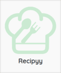

# Recipyy



Website for planning and creating recipes, made for the HCI course. Built with Angular and NodeJS.

This repo contains the backend for the site.

## **The Frontend can be found [here](https://github.com/Nour-2003/Recipyy-frontend.git)**

---

## Steps to run

* To run the project use

```bash
npm run start
```
* To run in development mode use
```bash
npm run start:dev
```

---

## Libraries and dependencies

### Dependencies

| Package        | Version        |
|----------------|----------------|
| bcrypt         | 5.1.1         |
| cloudinary     | 2.5.1         |
| cors           | 2.8.5         |
| dotenv         | 16.4.5        |
| express        | 4.21.1        |
| jsonwebtoken   | 9.0.2         |
| mongoose       | 8.8.2         |
| multer         | 1.4.5-lts.1   |
| nodemon        | 3.1.7         |
| streamifier    | 0.1.1         |
